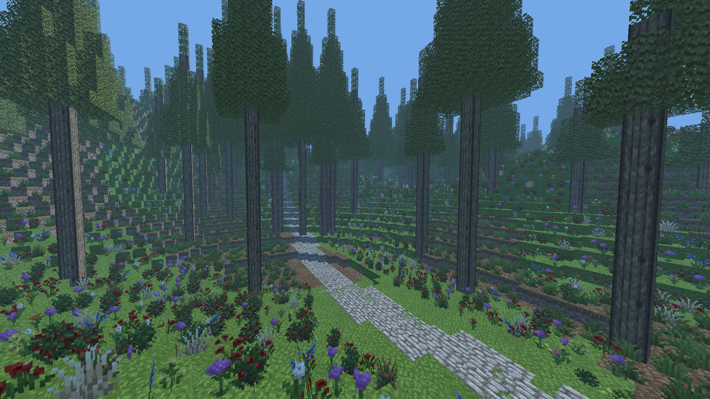

# Caligo


A voxel engine in C# (.NET 10) with procedural world generation using OpenGL rendering.

## Description

Caligo generates infinite terrain using chunk-based world generation (16³ voxel chunks). The engine uses multi-threaded
generation, greedy meshing, and GPU-side rendering optimizations including texture atlasing and indirect draw buffers.

World data is stored using morton-order curves for cache-efficient access. Chunks are generated asynchronously on worker
threads and automatically loaded/unloaded based on camera position.

## Content System

Content is organized into **modules** stored in the `modules/` directory. Each module contains:

```
modules/mymodule/
├── blocks/              # Block definitions (JSON)
├── textures/            # Block textures (PNG)
├── shaders/             # Shaders (.vert, .frag, .comp)
├── fonts/               # Fonts used in the UI (ttf)
├── blockmodels/         # Block geometry models (JSON)
└── config.json          # Various configuration values.
```

Modules are loaded at runtime with namespaced identifiers (`core:stone`, `mymod:block`). Add new content by creating a module directory—no recompilation needed.

## Building

Requires .NET 10.0 SDK and OpenGL 4.0+.

```bash
dotnet build
dotnet run --project Caligo.Client
```

**Controls**: WASD to move, mouse to look, Shift for speed boost. F1 for developer tools.

